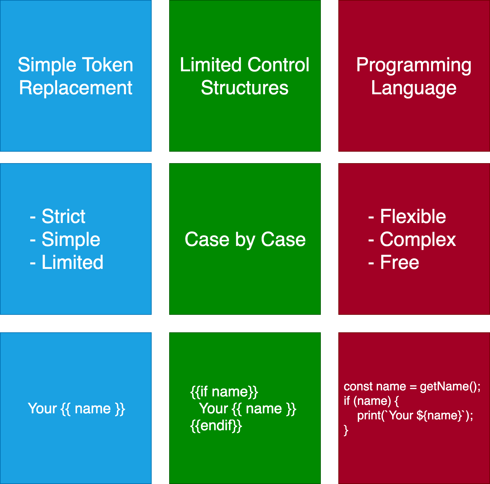

# simple-token-replacement-template [](https://travis-ci.org/azu/simple-token-replacement-template)

A reference implementation for Simple token replacement template.

There are three major “levels” of functionality in templating languages.

- Simple Token Replacement
- Limited Control Structures
- Programming Language



## Install

Install with [npm](https://www.npmjs.com/):

    npm install simple-token-replacement-template

## Usage

Compile `template` with `values`.

```js
import { compileTemplate } from "simple-token-replacement-template";
const result = compileTemplate(`Your name is {{name}}. Your age is {{age}}.`, {
    name: "tom",
    age: "18"
});
assert.strictEqual(result, `Your name is tom. Your age is 18.`);
```

If missing variable is put, pass through it as string.

```js
import { compileTemplate } from "simple-token-replacement-template";
const result = compileTemplate(`{{missing}}`, {});
assert.strictEqual(result, `{{missing}}`);
```

## Changelog

See [Releases page](https://github.com/azu/simple-token-replacement-template/releases).

## Running tests

Install devDependencies and Run `npm test`:

    npm test

## Contributing

Pull requests and stars are always welcome.

For bugs and feature requests, [please create an issue](https://github.com/azu/simple-token-replacement-template/issues).

1. Fork it!
2. Create your feature branch: `git checkout -b my-new-feature`
3. Commit your changes: `git commit -am 'Add some feature'`
4. Push to the branch: `git push origin my-new-feature`
5. Submit a pull request :D

## Author

- [github/azu](https://github.com/azu)
- [twitter/azu_re](https://twitter.com/azu_re)

## License

MIT © azu
